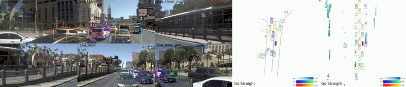
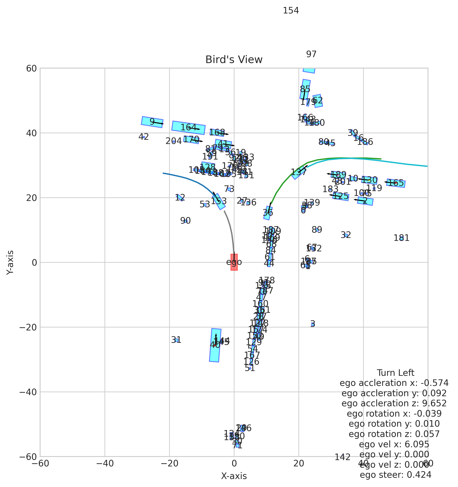
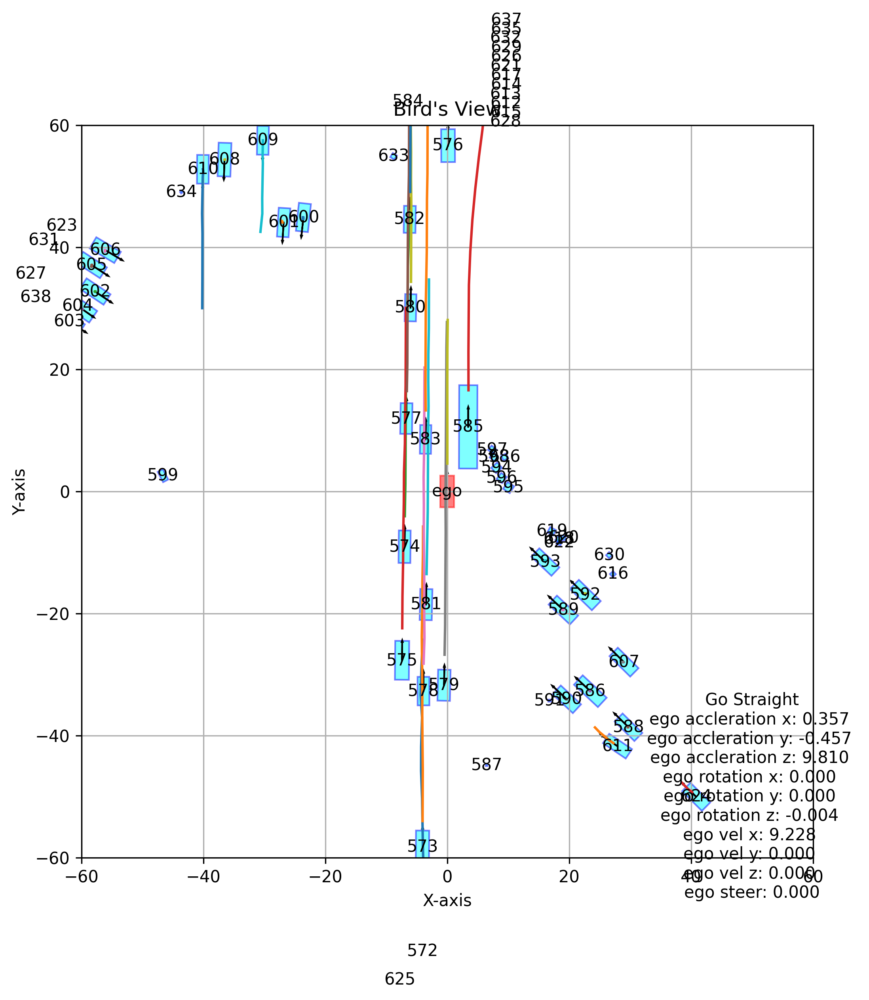

# Mitigation of SparseDrive from nuscenes to nuplan

## Introduction
This is a fork of the official [SparseDrive](https://github.com/swc-17/SparseDrive) repository. Major target of this fork is to mitigate the SparseDrive model to nuplan dataset. SparseDrive is a Sparse-Centric paradigm for end-to-end autonomous driving. It is trained and validated with the nuscenes dataset. Since 2022 the nuplan dataset has been released as the world's first large-scale planning benchmark for autonomous driving. It provides both open and closed loop resimulation to enable validation on planners. It would be interesting to see how the SparseDrive behaves in the nuplan dataset. 


## Works have been done so far
- A nuplan_converter is created for converting the nuplan dataset into the same format of pkl file as in the original [SparseDrive](https://github.com/swc-17/SparseDrive). An internal Bird's view visualization is implemented to verify whether the converted data format is correct.
- Both test and visualization are slightly adapted so that it works with the nuplan converted pkl.
- As I don't have a powerful GPU that is compatible with flashattention in my local machine, I have used a cloud remote with Nvidia 4090 for training and inference, while data conversion and visualization is remained in local machine. For this purpose I developed change_info_cam_path.py to adapt the image path in pkl files between remote and local. Benefit of this is: Data conversion (especially with full dataset) does not require a powerful GPU but could take long time, this could save some money. In addition one don't need to download the whole dataset at remote, but only the images.
- Scripts files are created to running steps including data preparation, testing, visualization easily both on local and remote.
- So far only tested with the nuplan mini dataset

## Intermediate result
### inference nuplan mini dataset
model: use the one released by SparseDrive: [ckpt](https://github.com/swc-17/SparseDrive/releases/download/v1.0/sparsedrive_stage2.pth) 


### Birdsview plot comparsion between nuscenes and nuplan after data conversion
nuscenes example


nuplan example


## Conclusion
The inference has showed that the detection and prediction has generally worked however its performance is still poor. This could be related to: 
- the actual camera mounting position and intrinsic in nuplan vehicles are not fully same as in nuscenes vehicles. these datas are unfortunately not given in nuplan dataset. Therefore the datas from nuscenes are used instead. 

## next step
- fine-tuning of the already released [ckpt](https://github.com/swc-17/SparseDrive/releases/download/v1.0/sparsedrive_stage2.pth) with nuplan dataset may improve the performance.

## Quick Start
The quick start is slightly different compare to the orignal [Quick Start](docs/quick_start.md). But it is compatible with all the original SparseDrive functions.

### Set up a new virtual environment, 
python 3.9 is used in oder to be compatible with nuplan
```bash
conda create -n sparsedrive python=3.9 -y
conda activate sparsedrive
```

### Install dependency packpages
```bash
sparsedrive_path="path/to/sparsedrive"
cd ${sparsedrive_path}
pip install --upgrade pip
pip install torch==1.13.0+cu116 torchvision==0.14.0+cu116 torchaudio==0.13.0 --extra-index-url https://download.pytorch.org/whl/cu116
pip install -r requirement.txt
pip install mmcv-full==1.7.1 -f https://download.openmmlab.com/mmcv/dist/cu116/torch1.13/index.html
```

### Compile the deformable_aggregation CUDA op
```bash
cd projects/mmdet3d_plugin/ops
python3 setup.py develop
cd ../../../
```
### Prepare the data
Download the [Nuplan dataset](https://www.nuscenes.org/nuplan#download), it should be put as below file structure<br>
-dataset <br>
--maps<br>
--nuplan-v1.1<br>
---sensor_blobs<br>
---splits<br>

```bash
cd ${sparsedrive_path}
mkdir data_nuplan
```
Open project with VSCode. Launch Nuplan data preparation Script from launch.json file (make sure you have adapted the pathes in launch.json accordingly). Results file will be written under data_nuplan as .pkl. <br>

If you need to use the .pkl file also on another machine, you could run change_info_cam_path.py (make sure you have adapted the LOCAL_PATH and REMOTE_PATH accordingly), this will generate a new .pkl that could be used on the target machine.

### Generate anchors by K-means
Gnerated anchors are saved to data/kmeans and can be visualized in vis/kmeans.
```bash
sh scripts/kmeans.sh
```

### Download pre-trained weights
Download the required backbone [pre-trained weights](https://download.pytorch.org/models/resnet50-19c8e357.pth).
```bash
mkdir ckpt
wget https://download.pytorch.org/models/resnet50-19c8e357.pth -O ckpt/resnet50-19c8e357.pth
```

### Commence training and testing

# train
to be added

# test
Open project with VSCode. Launch Nuplan Test Script from launch.json file (make sure you have adapted the pathes in launch.json accordingly)

or

```
sh tools/test_nuplan.sh #if you are on a machine without flashattention compatibility

sh tools/test_nuplan_remote.sh #if you are on a machine with flashattention compatibility
```

### Visualization
Open project with VSCode. Launch Nuplan Visualize Script from launch.json file (make sure you have adapted the pathes in launch.json accordingly)

or

```
sh tools/visualize_nuplan.sh
```